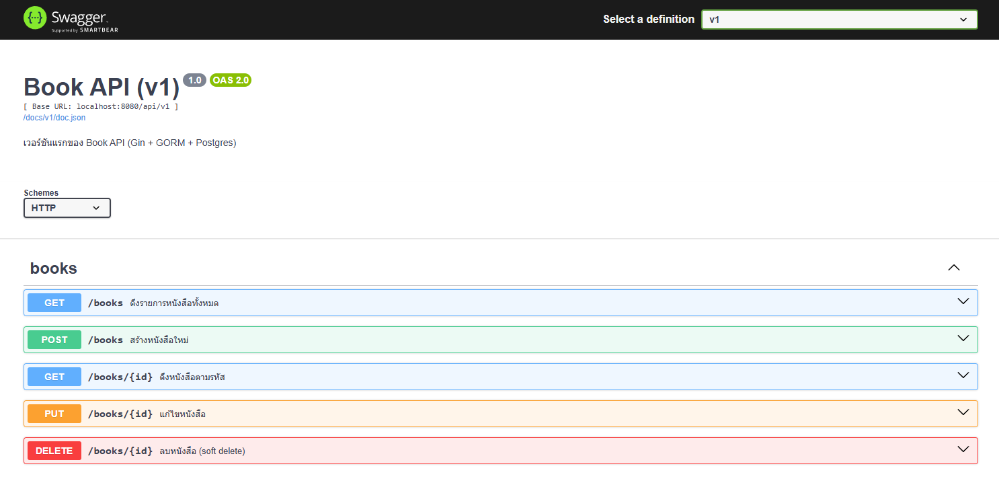
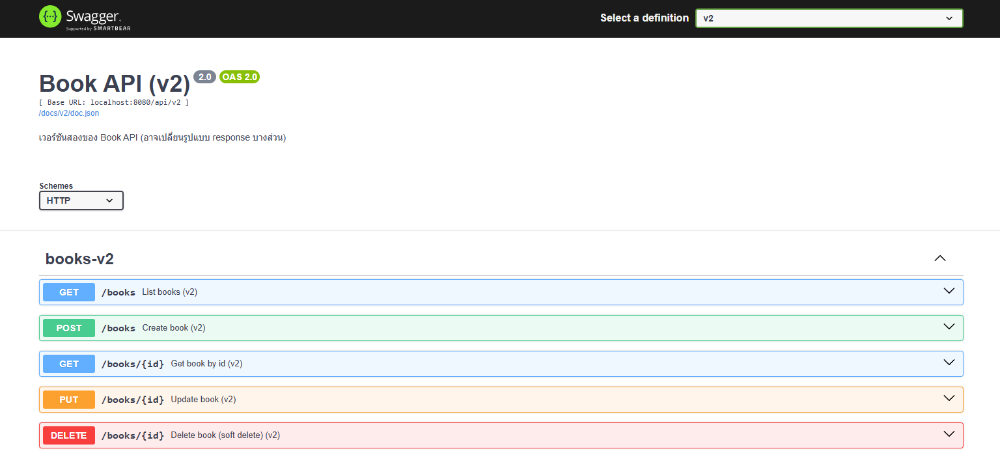

# go-101-CleanCRUD

CRUD ตัวอย่าง **Book API** ด้วย **Go + Gin + GORM + PostgreSQL**  
โครงแบบ **Clean Architecture** + **API Versioning (v1/v2)** + **Swagger** และ **Access Log** (บันทึก request/response, แยกโฟลเดอร์รายวัน, หมุนไฟล์ทุก 10 นาที)


**ฟีเจอร์หลัก**
- CRUD หนังสือด้วย **Gin** + **GORM** + **PostgreSQL**
- **RESTful CRUD**: `GET/POST/PUT/DELETE /api/v1|v2/books`
- **API Versioning**: แยก handler และเอกสารเป็นคนละเวอร์ชันชัดเจน
- **Swagger UI หน้าเดียว** `/swagger` (มี dropdown ให้เลือก v1/v2)
- **Mapper** : map object เข้าสู่ request
- **Validation**: ห้ามชื่อหนังสือซ้ำ (ตอบ `409`)
- **Logging**: บันทึก **request/response** แยกโฟลเดอร์รายวัน หมุนไฟล์ใหม่ทุก **10 นาที**
- **Soft delete** ด้วย `deleted_at`
- **Clean Architecture**: domain / application / infrastructure / presentation


---

## Swagger Screenshots






---


## Structure
```
├─ domain/                          # กติกาโดเมน (Entity, Error)
├─ application/
│  ├─ dto/                          # Application DTO (command/read model)
│  └─ usecase/                      # Use cases (ไม่ผูก framework)
├─ infrastructure/
│  ├─ logging/                      # Zap logger adapter
│  └─ persistence/
│     └─ gorm/                      # GORM adapter + AutoMigrate + Indexes
├─ presentation/
│  ├─ http/                         # Router (package httpx) + Swagger UI page
│  │  ├─ v1/                        # Transport/Mapper/Handlers/SwaggerInfo
│  │  └─ v2/                        # Transport/Mapper/Handlers/SwaggerInfo
│  └─ middleware/
│     └─ accesslog.go               # Access log (rotate 10 mins)
├─ docs/
│  ├─ v1/                           # สเปก Swagger (gen โดย swag)
│  └─ v2/
├─ .env
└─ main.go
```

---

## Requirements
- Go 1.21+
- PostgreSQL 13+
- PowerShell (สำหรับสคริปต์ตัวอย่าง) หรือใช้คำสั่งเทียบเท่าบน Mac/Linux

---

## Go packages

```bash
# เว็บเฟรมเวิร์ก + ORM + Postgres driver + .env
go get github.com/gin-gonic/gin gorm.io/gorm gorm.io/driver/postgres github.com/joho/godotenv

# เครื่องมือ gen เอกสาร (รันครั้งเดียวพอ)
go install github.com/swaggo/swag/cmd/swag@latest

# Swagger UI (router ใช้)
go get github.com/swaggo/gin-swagger github.com/swaggo/files

# Logger (ใช้ใน use case)
go get go.uber.org/zap

# เครื่องมือช่วยดีบัก (optional)
go install github.com/go-delve/delve/cmd/dlv@latest
dlv version
```

---


## Quick Start

1) ตั้งค่า env
```bash
cp .env.example .env
# ปรับค่า DB_DSN ให้ตรงกับเครื่องคุณ
```

2) ติดตั้ง dependency
```bash
go mod tidy
```

3) สร้างตาราง (ครั้งแรก)
```sql
CREATE TABLE IF NOT EXISTS public.books (
    id          BIGSERIAL PRIMARY KEY,
    title       TEXT        NOT NULL,
    author      TEXT        NOT NULL,
    created_at  TIMESTAMPTZ NOT NULL DEFAULT now(),
    updated_at  TIMESTAMPTZ NOT NULL DEFAULT now(),
    deleted_at  TIMESTAMPTZ NULL
);
```

4) สร้างเอกสาร Swagger (แยก v1/v2)
> คำสั่งนี้ **จำกัดโฟลเดอร์** ไม่ให้สแกนสลับเวอร์ชันกัน
```powershell
# ล้างของเก่า (ถ้ามี)
Remove-Item -Recurse -Force .\docs\v1, .\docs\v2 2>$null

# v1
swag init `
  -g .\presentation\http\v1\swagger_info.go `
  -o .\docs\v1 `
  --instanceName v1 `
  --dir .\presentation\http\v1,.\application,.\domain

# v2
swag init `
  -g .\presentation\http\v2\swagger_info.go `
  -o .\docs\v2 `
  --instanceName v2 `
  --dir .\presentation\http\v2,.\application,.\domain
```

5) รัน
```bash
go run .
```

6) เปิดใช้งาน
- Swagger UI: **http://localhost:8080/swagger** (มี dropdown v1/v2)  
  - บังคับเปิดเริ่มที่ v2: `http://localhost:8080/swagger?urls.primaryName=v2`
- สเปก JSON:  
  - v1 → `http://localhost:8080/docs/v1/doc.json`  
  - v2 → `http://localhost:8080/docs/v2/doc.json`

---


---

## API (โดยย่อ)
- `GET /api/v{n}/books` – list
- `GET /api/v{n}/books/:id` – get by id
- `POST /api/v{n}/books` – create (ห้ามชื่อซ้ำ → 409)
- `PUT /api/v{n}/books/:id` – update (ห้ามชื่อซ้ำ → 409)
- `DELETE /api/v{n}/books/:id` – soft delete

> `{n}` คือเวอร์ชัน เช่น `v1`, `v2`

---

## Logging
- Middleware: `presentation/middleware/accesslog.go`
- ไฟล์อยู่ที่ `logs/YYYY-MM-DD/log_YYYY-MM-DD_HH-mm.log`
- หมุนไฟล์ใหม่ทุก **10 นาที**
- ฟอร์แมตโดยย่อ:  
  `2025-08-09 05:01:14.533 [books] [info] ...`  
- middleware จะบันทึก **ทั้ง request & response** ทุกระดับ (info/warn/error)

---

## Mapper (แนวคิด)
- **Transport (v1/v2)** ↔ **Application DTO** ↔ **Domain**
- แยก mapper ต่อเวอร์ชันไว้ใน `presentation/http/v1/mapper.go` และ `v2/mapper.go`
- เปลี่ยน schema ฝั่ง Transport ได้โดยไม่กระทบ use case

---

## API Version Control — แนวทางและการเพิ่ม **v3**

### แนวคิด
- โค้ดแยกตามเวอร์ชันใน `github.com/nuba55yo/go-101-CleanCRUD/presentation/http/vX`
- Router group แยก `/api/v1`, `/api/v2`, ... ชี้ไป handler เวอร์ชันนั้นๆ
- Swagger แยกสเปกคนละชุดที่ `/docs/vX/*` แล้วใช้หน้า UI กลาง `/swagger` (dropdown)  
  → ป้องกัน asset 404 เวลาเปลี่ยนเวอร์ชัน

### ขั้นตอนเพิ่ม **v3**

1) สร้างไฟล์/โฟลเดอร์
```
presentation/http/v3/
  mapper.go
  transport.go
  swagger_info.go
  book_handler.go    # ก็อปจาก v2 แล้วปรับตามพฤติกรรม v3
```

ตัวอย่าง `ithub.com/nuba55yo/go-101-CleanCRUD/presentation/http/v3/swagger_info.go`:
```go
package v3

// Book API v3 docs.
//
// @title       Book API (v3)
// @version     3.0
// @description ตัวอย่างเวอร์ชัน 3
// @schemes     http
// @host        localhost:8080
// @BasePath    /api/v3
```

2) ผูกเส้นทางใน Router (`github.com/nuba55yo/go-101-CleanCRUD/presentation/http/router/router.go`):
```go
import (
    // ...
    v3 "github.com/nuba55yo/go-101-CleanCRUD/presentation/http/v3"
)

func New(svc service.BookService) *gin.Engine {
    r := gin.New()
    // ... middleware

    // v3
    apiV3 := r.Group("/api/v3")
    {
        apiV3.GET("/books", v3.GetBooks(svc))
        apiV3.GET("/books/:id", v3.GetBook(svc))
        apiV3.POST("/books", v3.CreateBook(svc))
        apiV3.PUT("/books/:id", v3.UpdateBook(svc))
        apiV3.DELETE("/books/:id", v3.DeleteBook(svc))
    }
    return r
}
```

3) main.go — เพิ่มเส้นทางสเปกและ dropdown
```go
// import docs v3
_ "github.com/nuba55yo/go-101-CleanCRUD/docs/v3"

// เสิร์ฟ doc.json ของ v3
httpRouter.GET("/docs/v3/*any", ginSwagger.WrapHandler(swaggerFiles.Handler, ginSwagger.InstanceName("v3")))
```

ถ้าใช้หน้า Swagger แบบ **custom HTML** (ใน `main.go`) ให้เพิ่มรายการ v3 เข้าไป:
```js
urls: [
  { url: '/docs/v1/doc.json', name: 'v1' },
  { url: '/docs/v2/doc.json', name: 'v2' },
  { url: '/docs/v3/doc.json', name: 'v3' }
]
```

4) gen สเปกของ v3
```powershell
swag init `
  -g .\presentation\http\v3\swagger_info.go `
  -o .\docs\v3 `
  --instanceName v3 `
  --dir .\presentation\http\v3,.\application,.\domain
```

5) ทดสอบ
- `http://localhost:8080/docs/v3/doc.json` → ต้องมี `"basePath": "/api/v3"`
- `http://localhost:8080/swagger?urls.primaryName=v3` → UI เปิดที่ v3 โดยอัตโนมัติ

